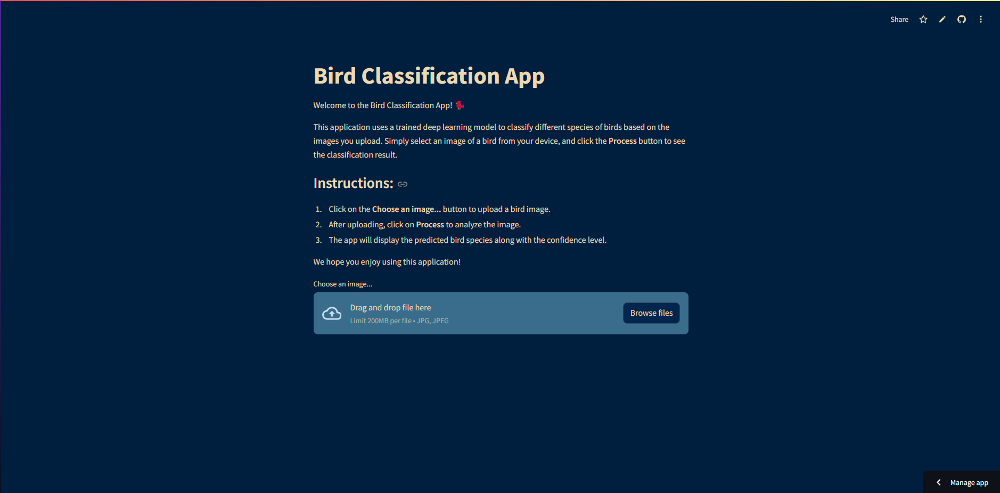

# Bird Classification App 🦉

Welcome to the **Bird Classification App**! This app uses Convolutional Neural Networks (CNNs) to identify bird species from uploaded images. With a friendly Streamlit interface, users can explore bird classification powered by deep learning and computer vision. 🐦📸

  
*Screenshot of the Bird Classification App Interface*

## ✨ Features

- 🖼️ **Image Upload**: Easily upload an image of a bird for classification.
- ⚡ **Real-Time Predictions**: Get instant predictions with confidence scores.
- 🎨 **User-Friendly Interface**: Navigate through a smooth, responsive UI built with Streamlit.

## 🚀 Quick Start

### Prerequisites

- Python 3.8+
- Streamlit
- TensorFlow

### Installation

1. **Clone the repository**  
   ```bash
   git clone https://github.com/your-username/bird-classification-app.git
   cd bird-classification-app
2. **Create a virtual environment (recommended)**
   ```bash
   python -m venv env
   source env/bin/activate  # On Windows, use `env\Scripts\activate`
3. Install dependencies
   ```bash
   pip install -r requirements.txt
4. Run the App
   ```bash
   streamlit run app.py

## 🐥 Usage

1. Upload an Image: Select or drag a bird image file to the upload section.
2. View the Prediction: The app will display the predicted species and confidence score.

## 🛠️ Technologies
- Streamlit - Interactive web app interface
- TensorFlow - Deep learning framework for training the CNN model
- OpenCV - Image processing

## 📂 Project Structure
```plaintext
bird-classification-app/
├── 📄 app.py                   # Main Streamlit app file
├── 📁 model/                   # Directory containing the trained model
│   └── 📄 bird_classification_model.h5  # Pre-trained model file
├── 📁 images/                  # Directory for storing example images/screenshots
│   └── 📄 example_bird.png     # Sample bird image for testing
├── 📁 data/                    # Directory for storing additional data or labels (optional)
│   └── 📄 bird_labels.csv      # Bird species labels and metadata
├── 📄 requirements.txt         # List of dependencies
├── 📄 README.md                # Project documentation (this file)
└── 📄 .gitignore               # Files and directories to ignore in version control
```

## 🙏 Acknowledgments
This project is inspired by the beauty and diversity of bird species. Special thanks to **Umair Shah Pirzada** for providing the bird image dataset and to the Streamlit community for their resources and support.
